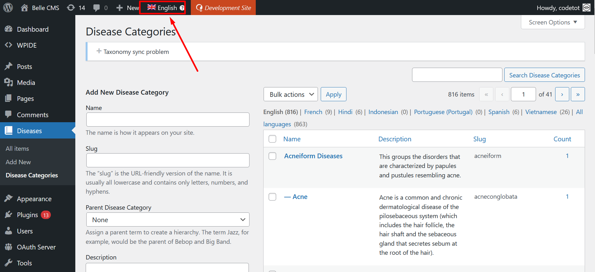
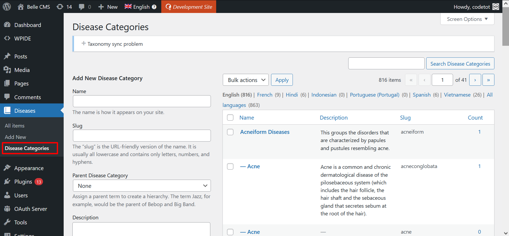
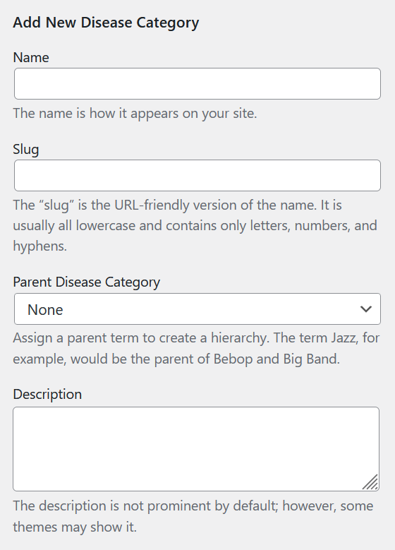
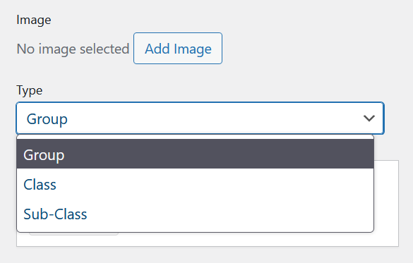

# Danh mục bệnh

## Cấp độ và yêu cầu

- Người dùng cần và nên có quyền `edit_posts` trở lên để chỉnh sửa danh mục bệnh.
- Plugin `Torus Data` cần được bật và đang sử dụng.
- Để đồng bộ bản dịch danh mục bệnh cho các ngôn ngữ khác, làm theo hướng dẫn [Dịch danh mục bệnh](wpml.md#dịch-disease-category).
- Chỉ nên thêm danh mục mới nếu ngôn ngữ quản lý đang hiển thị là tiếng Anh. Kiểm tra thanh bar trên cùng màu đen.

## Cảnh báo

Mặc dù chức năng thêm và quản lý danh mục bệnh có hoạt động, hệ thống nên sử dụng chức năng import danh mục bệnh để quản lý chặt chẽ hơn.

## Menu truy cập

Từ giao diện sau khi đăng nhập, truy cập **Disease** tìm menu con **Disease Category**

## Thêm danh mục bệnh mới

Cột bên trái là nơi thêm danh mục bệnh mới. Cột này bao gồm các mục:

- Name: nhập tên bệnh, bằng tiếng Anh
- Slug: bỏ trống (sẽ tự tạo) hoặc thêm (cái này dùng để tra cứu trên API)
- Parent Disease Category: chọn danh mục cha nếu danh mục định thêm là danh mục con
- Description: Mô tả vê danh mục

- Image: thêm ảnh minh hoạ cho danh mục
- Type: chọn loại cho danh mục, có 3 loại là **Group**, **Class** và **Sub-Class**.

- Language: mục này không thay đổi, vẫn giữ nguyên ngôn ngữ là English.

Cuối cùng, ấn nút *Add New Disease Category** để hoàn tất.
