# Disease

- [Menu truy cập](#menu-truy-cập)

## Menu truy cập

Từ màn hình chính sau khi đăng nhập, chọn menu "Disease" > "All items".

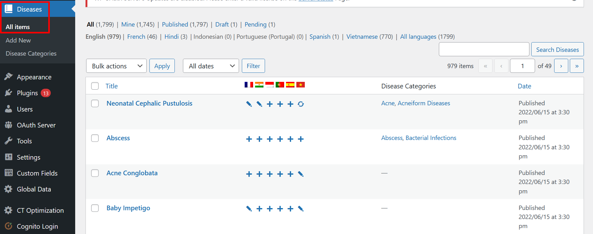

## Thêm Disease mới

Bấm vào nút "Add New".

**Lưu ý: Chi thêm Disease với ngôn ngữ là tiếng Anh là bản gốc, các ngôn ngữ khác chỉ dịch lại**.

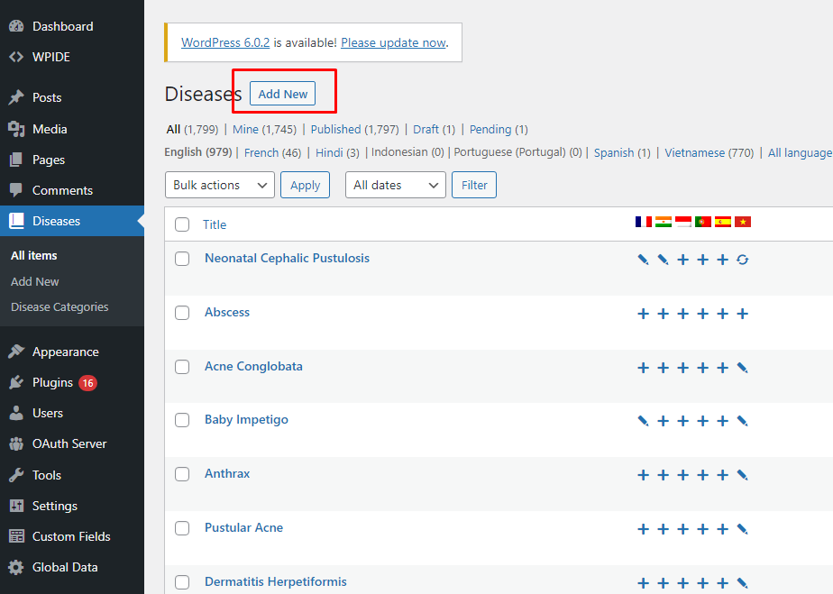

## Sửa Disease có sẵn

Để sửa một Disease hiện tại, click thẳng vào tên của Disease.
Tiếp theo, bạn xem mục "Cập nhật dữ liệu Disease" ở phần dưới.

Ngoài chế độ sửa trực tiếp, hệ thống còn mặc định bổ sung thêm chế độ sửa nhanh cho một số nội dung cơ bản như tiêu đề, đường dẫn, thời gian, tác giả...

## Dịch Disease

Nếu là thêm bản dịch cho Disease có sẵn bằng tiếng Anh, xem [hướng dẫn dịch disease](wpml-translators.md#dịch-disease)

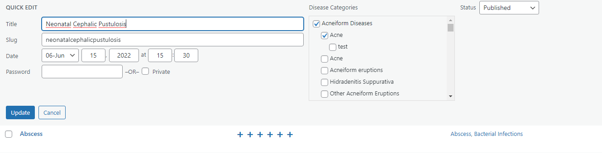

## Xoá Disease

Rê chuột vào từng dòng trong danh sách, sẽ có các tuỳ chọn thêm. Ấn **"Trash"** để chuyển vào Thùng rác.

Nội dung quá 30 ngày sẽ được tự động xoá. Hoặc bạn tiếp tục vào Thùng rác để xoá vĩnh viễn.

Nếu khi rê chuột không có phần "Trash", do tài khoản của bạn không đủ quyền để thực hiện công việc này.

## Cập nhật dữ liệu Disease

Khi thêm mới hoặc sửa Disease, bạn sẽ nhập các mục dưới đây. Dữ liệu mỗi loại Disease bao gồm:

**Cơ bản**

- Tên Disease và mô tả

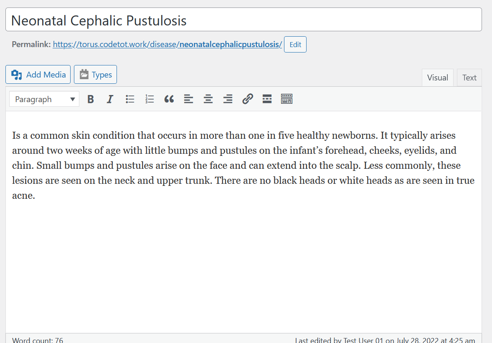

- Ảnh đại diện (Featured Image) - 1 ảnh

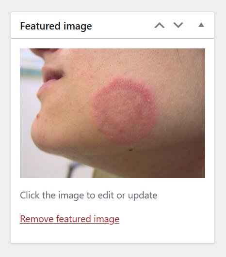

- Danh mục Disease (Category)

Khi chọn Disease Category, tuân thủ quy tắc chọn đủ cả cha - con.

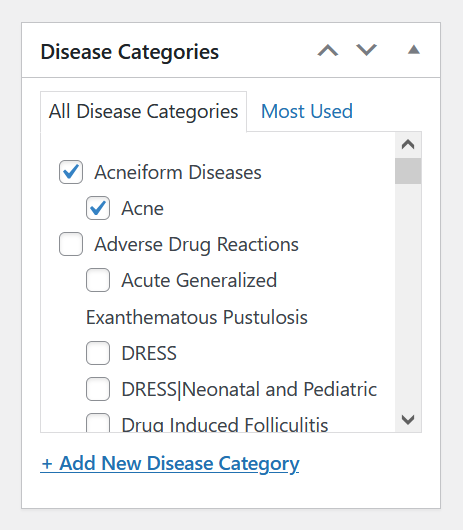

**Dữ liệu riêng**

Trừ `images` (là ảnh tải lên), tất cả dữ liệu còn lại là nội dung chữ nhập thông thường.

- No Prescription Treatment
- Main Cause
- Differential Diagnosis

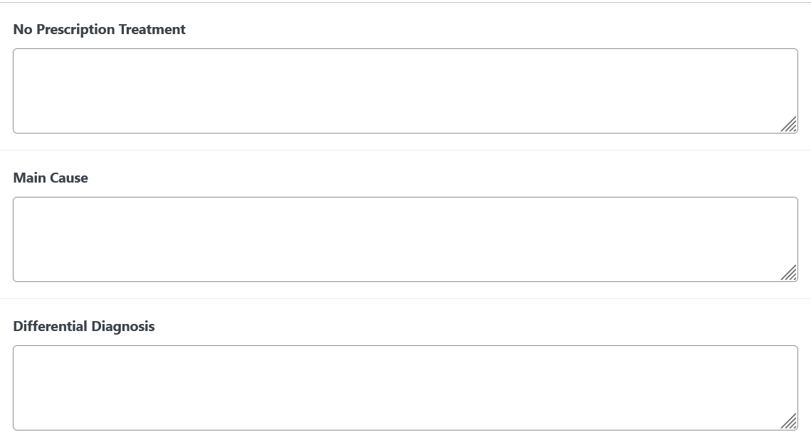

- Synonymes
- Cell Type
- Treatment

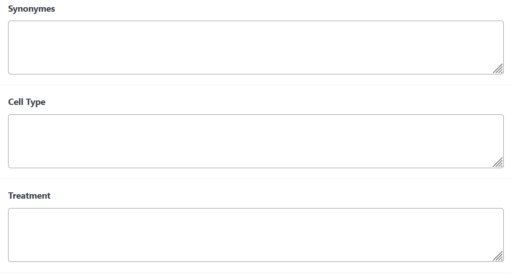

- Good To Know

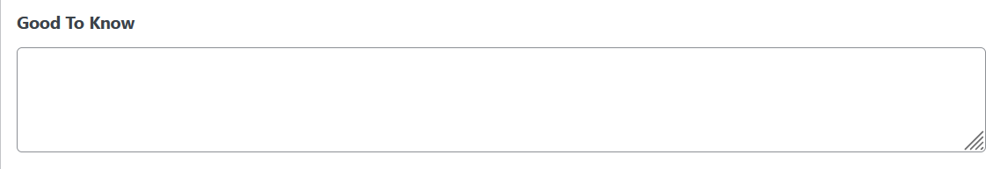

- Images (gồm các ảnh, mỗi ảnh gồm (Type) + Ảnh để phân loại và lọc)

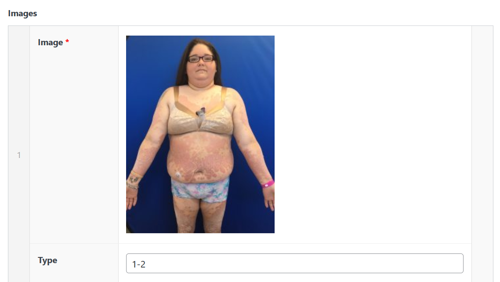

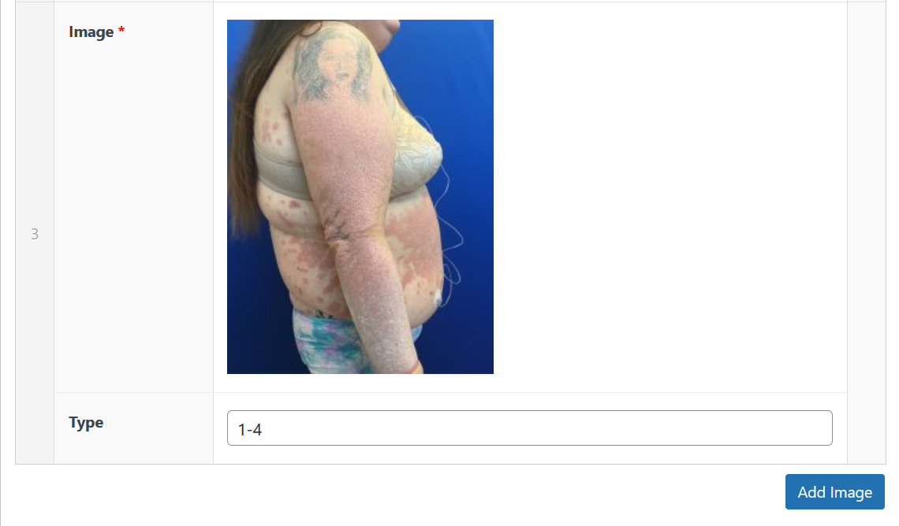
