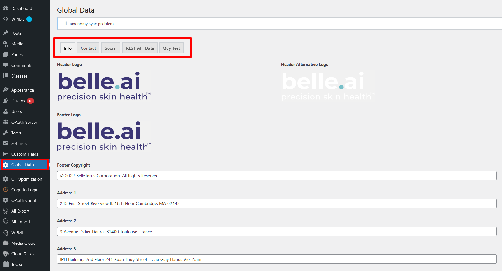
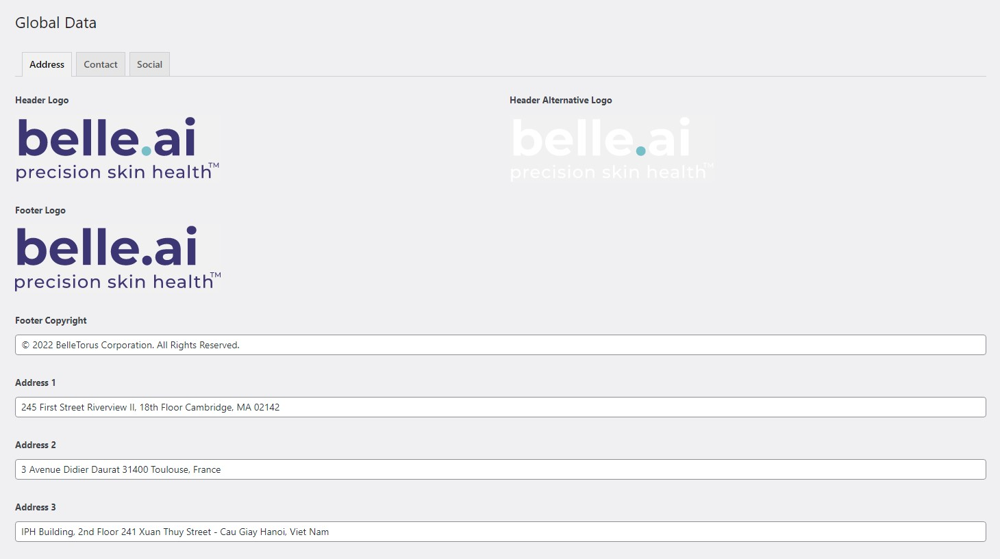
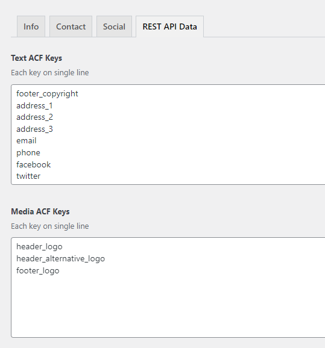

# Dữ liệu chung (Global Data)

## Cấp độ và yêu cầu

- Người quản lý có quyền cao nhất (Quản trị viên - Administrator - role `manage_options`)
- Plugin **Advanced Custom Fields (PRO)** đã được kích hoạt

## Menu truy cập

Sau khi đăng nhập, tìm menu chính **"Global Data"**, chọn các tab tương ứng để sửa nội dung.

Gồm các tab chính:

- **Info:** dữ liệu cơ bản nhất gồm Logo (logo đầu trang - màu nền tối và sáng, logo cuối trang), địa chỉ, thông tin bản quyền web
- **Contact:** dữ liệu email và số điện thoại
- **Social:** địa chỉ các mạng xã hội
- **REST API Data** (dành cho lập trình viên): thêm các key để hiển thị dữ liệu trong API endpoint. Xem mục "Thêm Global Data" để biết chi tiết

## Giới thiệu

Dữ liệu chung là các dữ liệu được quy ước sử dụng ở mọi nơi, cung cấp các thông tin cơ bản về Belle, bao gồm:

Các dữ liệu này được trích xuất qua endpoint [/get_global_data](rest-api.md#d%E1%BB%AF-li%E1%BB%87u-chung-global-data)

## Thêm Global Data

Cần thực hiện 2 bước: Edit Field Group (với quyền admin), và update tên field bổ sung dạng key tương ứng.

### Bước 1: Edit Field Group "Global Data"

_Trước khi edit bất kỳ field group này, bạn cần xem mục Custom Fields > tìm tab "Sync available" xem có code cập nhật không._

Vào bằng menu **Custom Fields** > chọn mục **Global Data**. Thêm field mới và lưu lại. Nên đặt tên theo dạng `a_b_c` cho keyword để đúng format hiện tại của code dự án.

Các định dạng field được hỗ trợ sẵn sàng để output.
- Text
- Url
- Image
- Textarea

### Bước 2: Thêm field key vào trong danh sách REST API trả ra

Trong menu chính Global Data, tìm tab REST API Data.

- Nếu key thêm là text thông thường, thêm vào `Text ACF Keys`.
- Nếu key là media (ảnh tải lên), thêm vào `Media ACF Keys`.

Kiểm tra bằng cách nhập liệu và mở API ra.

## Xoá/Đổi key Global Data

Tương tự như khi thêmn ở bước trên, với quyền admin, bạn làm lần lượt:
- Sửa field group "Global Data" trong menu Custom Fields
- Xoá tên key tương ứng trong menu Global Data > tab REST API Data.
