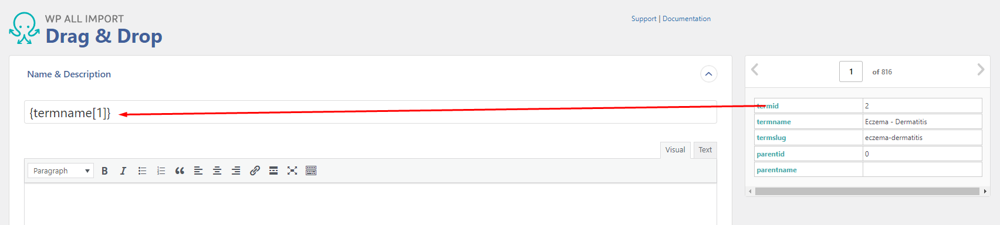
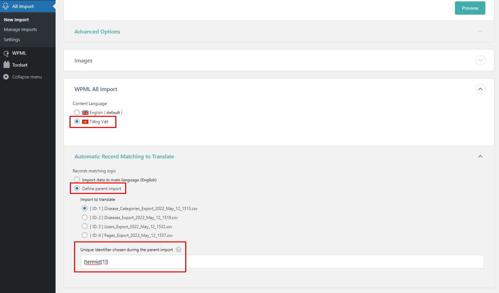

# Nhập và xuất dữ liệu

Các trường dữ liệu trên CMS đều có thể nhập vào và xuất ra cho việc chỉnh sửa, tuy vậy, sẽ hạn chế cho media như các file ảnh, file đính kèm. Phần xuất ra chỉ nên bao gồm nội dung text.

## Import data

Khi import data, phải đảm bảo đây là template từ chức năng Export để có sự đồng nhất dữ liệu (đối chiếu id của bản ghi dữ liệu).

Chọn All Import > New Import, chọn file và chuyển tới các bước. Drag (kéo)  trường dữ liệu từ bên phải vào ô dữ liệu tương đương.

Quan trọng hơn, với bản dịch là ngôn ngữ khác, ví dụ như export dữ liệu bản tiếng Anh ra và import là bản tiếng Việt, cần đảm bảo setting như sau:

Tức là termid hoặc postid được xác định theo 1 template đã export trước đó.

## Export data

Export data qua mấy bước:

- Chọn dữ liệu, có hai kiểu chính là post type (như Disease) và taxonomy (như Disease Category).
- Chọn các trường dữ liệu sẽ bổ sung, ngoài dữ liệu "Standard" thì cần bổ sung thêm dữ liệu là ACF.
- Xuất định dạng cuối là .csv
