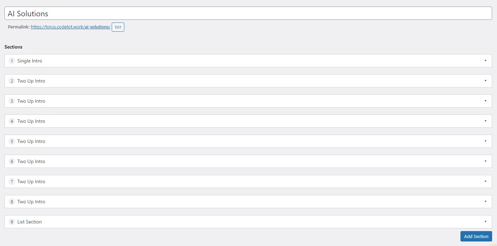

# Trang (Page)

Được thiết kế theo dạng modular, tức là trong trang chứa các section, mỗi section là một tổ hợp các dữ liệu nhập sẵn theo định dạng.

Section có thể tạo không giới hạn trong một trang. Bởi vậy, section sẽ có cách thức đặt theo bố cục, từ đó, khi lấy dữ liệu từ endpoint, kết quả đã được cấu trúc theo đúng thứ tự.

**Các trường dữ liệu thiết lập bố cục:**

- Section ID: tương đương `id="xxx"`, nên dùng định dạng nội dung không dấu kèm gạch ngang, ví dụ `belle-ai-solutions`.
- Section Style: là các format màu nền theo giao diện, ví dụ `light` là màu nền được quy ước.
- Image Alignment: là quy ước bố cục cho vị trí ảnh nếu một bố cục nhưng có nhiều kiểu trình bày

**Các trường dữ liệu cơ bản:**

- Title - tiêu đề, quy ước là nhập text, nhưng nên dùng thẻ Heading H1-H6 ở ngoài
- Description - mô tả ngắn, bao gồm cả HTML
- Button Text: tên nút bấm
- Button URL: liên kết của nút bấm, có thể nhập liên kết nội bộ hoặc liên kết ngoài

**Các trường dữ liệu khác**

- Gallery: thường là cho upload ảnh, mỗi ảnh khi click vào đều có thể nhập Alt (nên nhập để tăng A11y)
- List/Items: là danh sách lặp lại bên trong chứa trường dữ liệu.
