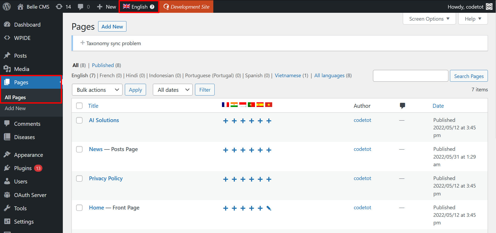

# Trang (Page)

## Menu truy cập

Từ giao diện chính sau khi đăng nhập, truy cập **Pages** > **All Pages**.

## Cấu trúc dữ liệu trang

Được thiết kế theo dạng module, tức là trong trang chứa các section, mỗi section là một tổ hợp các dữ liệu nhập sẵn theo định dạng.

Section có thể tạo không giới hạn trong một trang. Bởi vậy, section sẽ có cách thức đặt theo bố cục, từ đó, khi lấy dữ liệu từ endpoint, kết quả đã được cấu trúc theo đúng thứ tự.

**Các trường dữ liệu thiết lập bố cục:**

- Section ID: tương đương `id="xxx"`, nên dùng định dạng nội dung không dấu kèm gạch ngang, ví dụ `belle-ai-solutions`.

- Section Style: là các format màu nền theo giao diện, ví dụ `light` là màu nền được quy ước.

- Section Alignment: là các quy ước bố cục trái/phải/giữa cho nội dung chữ

- Image Alignment: là quy ước bố cục cho vị trí ảnh nếu một bố cục nhưng có nhiều kiểu trình bày

**Các trường dữ liệu cơ bản:**

- Title - tiêu đề, quy ước là nhập text, nhưng nên dùng thẻ Heading H1-H6 ở ngoài
- Description - mô tả ngắn, bao gồm cả HTML
- Button Text: tên nút bấm
- Button URL: liên kết của nút bấm, có thể nhập liên kết nội bộ hoặc liên kết ngoài

**Các trường dữ liệu khác**

- Gallery: thường là cho upload ảnh, mỗi ảnh khi click vào đều có thể nhập Alt (nên nhập để tăng chất lượng nội dung)

- List/Items: là danh sách lặp lại bên trong chứa trường dữ liệu. Nhập nhiều nội dung giống nhau.

## Thêm mới section

Trong màn hình sửa page, kéo xuống dưới cùng, tìm nút "Add Section", chọn loại để thêm.

## Xoá section

Rê chuột vào đầu mỗi section, sẽ có nút "Remove layout".

## Tạo bản sao section

Rê chuột vào đầu mỗi section, sẽ có nút "Duplicate layout".

## Dịch trang

Để tạo bản sao của một trang, thực hiện lần lượt các bước sau:

1. Sửa trang bản gốc bằng tiếng Anh và chọn từ cột bên > Translate This Document > Tick đánh đấu Duplicate vào ngôn ngữ cần dịch. Nút Duplicate hiện ra và nhấn xác nhận để tiến hành.

2. Sau khi duplicate (tạo bản sao) thành công, trang ngôn ngữ mới sẽ xuất hiện ở cột bên > Translations. Click vào biểu tượng Sửa để cấu hình trang bản dịch mới.

3. Ở bước này, cần tách bản dịch ra khỏi bản gốc (để khi sửa bản tiếng Anh, trang dùng ngôn ngữ khác không bị ghi đè dữ liệu). Đánh dấu vào ô để tách bản dịch.

