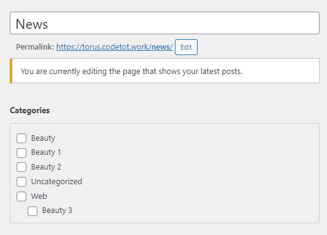

# Tin tức/Bài viết

## Set tin sticky (Highlight)

**Khi trong danh sách tin**

Chọn Quick Edit và tìm mục Sticky:

**Khi sửa tin lẻ**

Chọn mục Visibility và tìm mục Sticky:

## Cấu hình trang Posts (News Landing)

Khi sửa trang Posts, có thể chọn category nào sẽ xuất hiện trong API Endpoint `/get_page_for_posts`.
