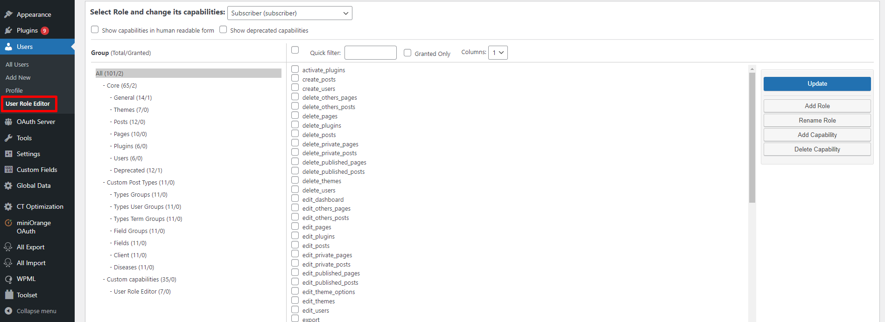
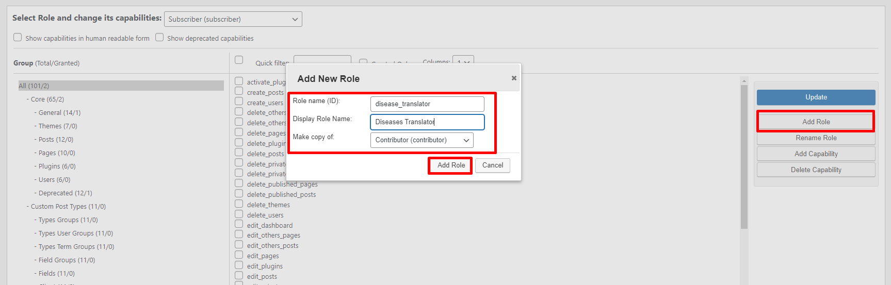
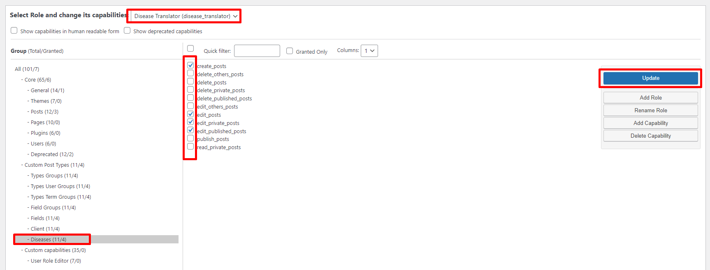
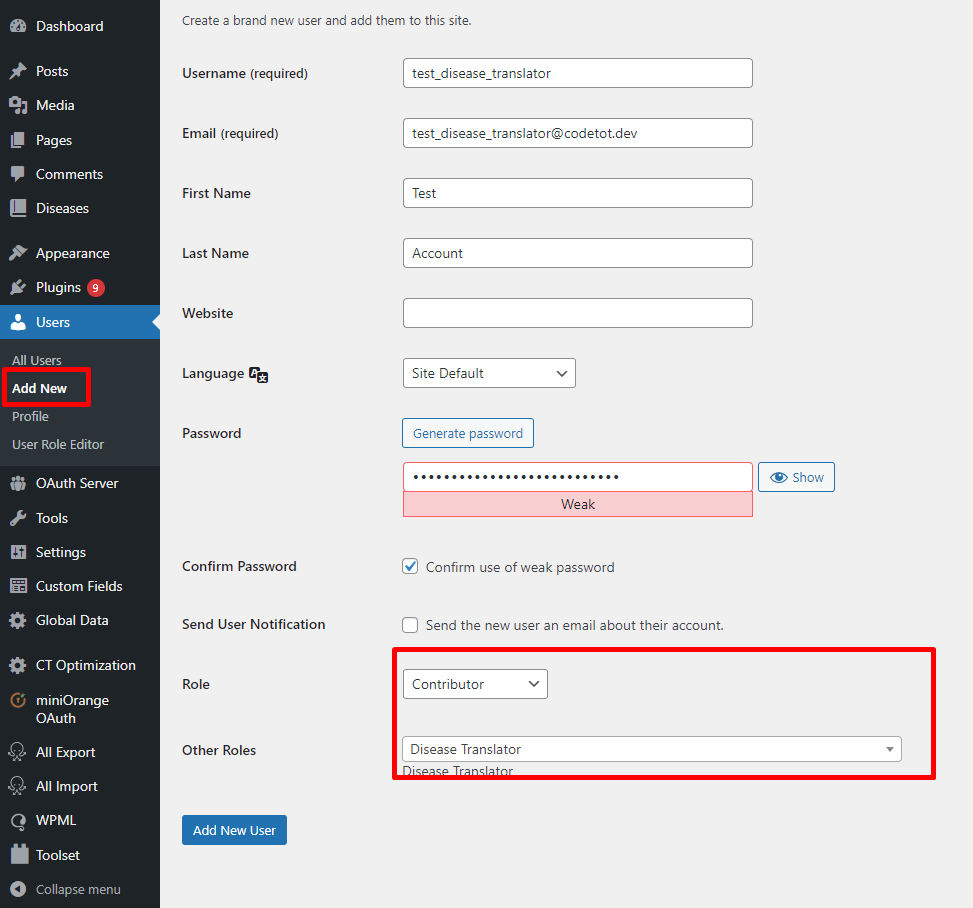
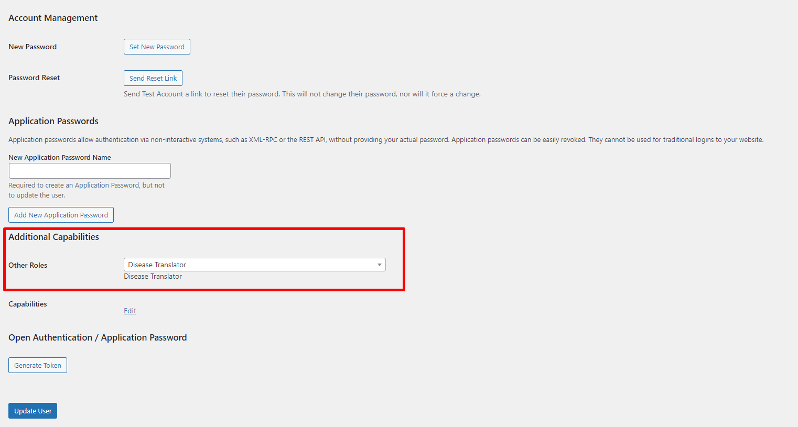
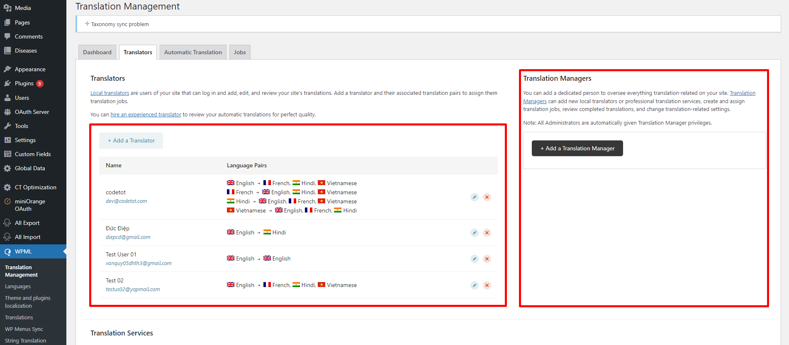
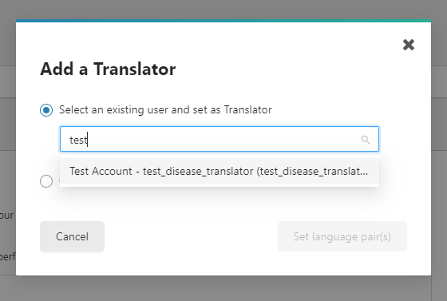
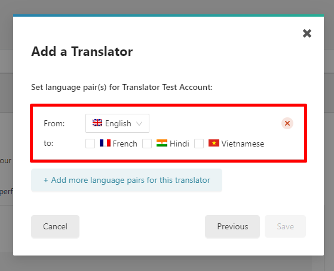

# Quản lý user dịch

**Cấp dộ và yêu cầu**

- Tài khoản có cấp bậc Administrator có thể quản lý tài khoản khác.
- CMS cần kích hoạt plugin [User Role Editor](https://wordpress.org/plugins/user-role-editor/)

**Yêu cầu cơ bản**

Để tạo hoặc cấp quyền phiên dịch cho một tài khoản, cần thực hiện đủ các bước sau:

- Tạo cấp bậc (Role) riêng để xác định nội dung được dịch
- Tạo/sửa tài khoản và gắn cấp bậc chính, cấp bậc cho phép dịch. Một tài khoản có thể có nhiều cấp bậc khác nhau
- Thêm tài khoản vào danh sách translator

## Tạo cấp bậc (Role) mới

1. Truy cập menu **Users > User Role Editor**

2. Ở cột bên phải, click vào nút "Add New Role". Màn hình popup hiện ra.

Lần lượt nhập các mục:

- ID: dạng string, chỉ gồm số, chữ cái và các kí tự `-`, `_`, không trùng
- Name: tên, dùng để hiển thị khi đặt cho tài khoản cấp bậc.
- Make copy of: sử dụng một trong các cấp bậc có sẵn, thường nên chọn Contributor nếu có thể cập nhật nội dung trong CMS.

3. Điều chỉnh các nội dung truy xuất của cấp bậc này

Chọn các nội dung user có thể truy xuất.

- Nên hạn chế các quyền xoá (delete), publish (công bố), `_others` (sửa/xoá nội dung của người khác)

Ấn nút **"Save"** để lưu lại các quyền đã chỉnh sửa.

## Kích hoạt cấp bậc dịch cho tài khoản

### Tạo tài khoản mới

Khi tạo tài khoản mới, chọn role chính là Contributor và role phụ là một trong các vị tri có thể dịch (vd: Disease Translator).

### Sửa tài khoản

Tài khoản có thể thay đổi quyền như cách tương tự tài khoản mới được tạo.

1. Chọn tài khoản tại menu Users > All Users
2. Chọn tên tài khoản để sửa

3. Sau khi chọn xong, click "Update user" để cập nhật quyền mới

## Thêm tài khoản vào công cụ Dịch

Truy cập menu **WPML > Translation Management**, và chọn tab "Translators"

Tại đây, bạn có thể thêm Người dịch (Translator) hoặc Người quản lý dịch (Translator Manager).

**Chức năng Thêm người quản lý dịch (Translator Manager) chỉ nên phục vụ việc thực hiện "Thêm người dịch", do thiếu các bước quan trọng khác để truy cập dữ liệu theo role (cấp bậc).**

### Thêm người dịch (Translator)

1. Click nút **Add a Translator**. Popup sẽ hiện ra.
2. Chọn **"Select an existing user and set as Translator"** tài khoản sẵn có đã tạo trước (để không thiếu bước đặt role cho tài khoản ở phía trước), click nút "Set language pair(s)" để chuyển tới màn hình chọn ngôn ngữ.

4. Tại bước này, chọn ngôn ngữ gốc và các ngôn ngữ có thể dịch cho tài khoản. Sau đó, ấn nút Save để hoàn thành.

