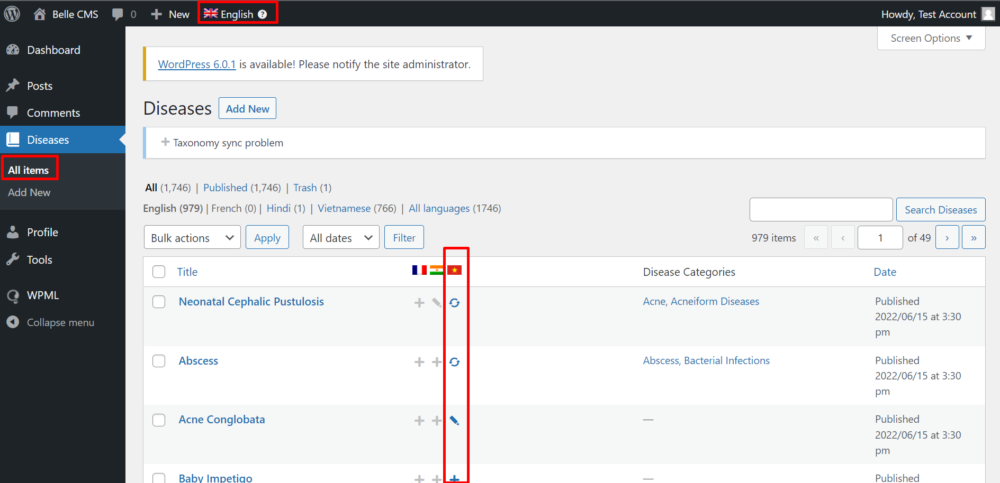
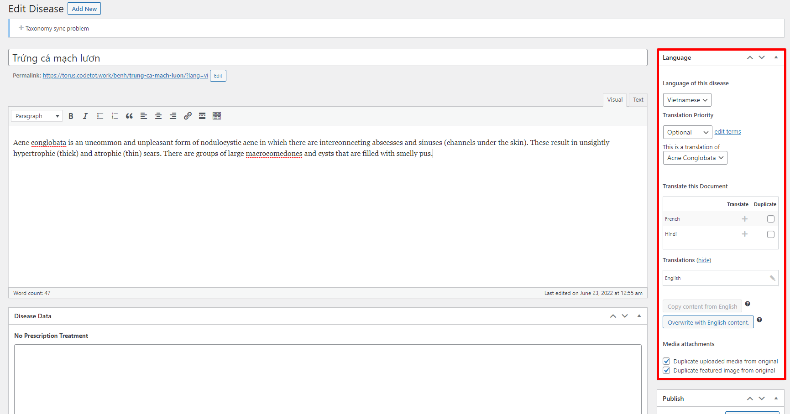

# Người dịch

Người dịch, khi được cấp tài khoản, có thể dịch các nội dung trong CMS.

**Yêu cầu**

- Đã đăng nhập thành công vào hệ thống quản trị.

## Dịch Disease

1. Truy cập menu **Diseases > All items**

- Chọn "Add new" ở menu **"Diseasess > Add new"** nếu thêm nội dung mới
- Chọn biểu tượng bên cạnh cột ngôn ngữ tương ứng với bài viết có thể dịch.
- Đảm bảo ngôn ngữ gốc có nội dung tương ứng hiển thị trên cùng ở màn hình.

### Các chức năng dịch

Với nội dung được dịch, bao gồm ba chức năng cho mỗi nội dung:

- Icon dấu cộng (+): Thêm bản dịch mới
- Icon hình bút (/): Sửa bản dịch
- Icon hình mũi tên 2 chiều: Cập nhật bản dịch (không sử dụng chức năng này - dành cho cấp bậc cao hơn)

### Sửa bản dịch

Khi sửa bản dịch, có các mục sau cần dịch lần lượt:

- Tiêu đề
- Nội dung

**Các dữ liệu Disease Data khác:**
- Không bao gồm mục "Language Code".
- Không cần thêm ảnh trong mục "Images".

Ngoài ra, các mục sau có thể lựa chọn:
- Disease Categories - chọn danh mục tương ứng trong danh sách. Nếu không có, báo lại với cấp cao hơn để bổ sung/thêm sau.

Cuối cùng, ấn nút "Submit for Review" để gửi yêu cầu duyệt bản dịch.
