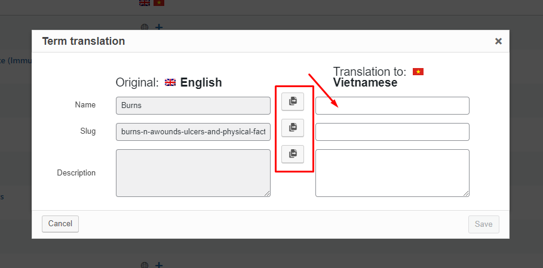

# Đa ngôn ngữ

Hệ thống sử dụng WPML - plugin tốt nhất về đa ngôn ngữ cho WordPress CMS.

## Dịch Disease Category

Truy cập vào menu **WPML > Taxonomy translation**, chọn **Disease Category** từ danh sách.

Chọn các item muốn dịch, sẽ có 1 popup hiện ra, nhập thông tin bổ sung và lưu lại.

