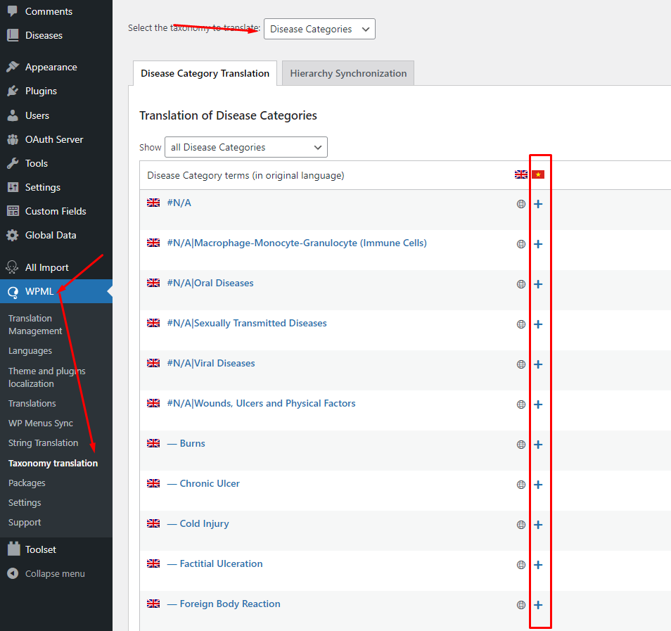
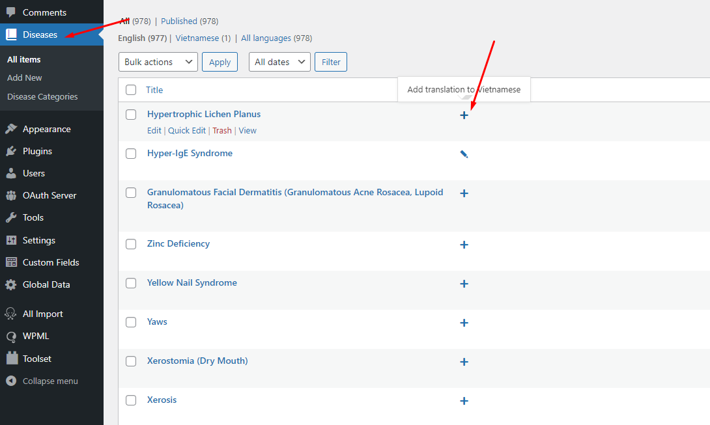
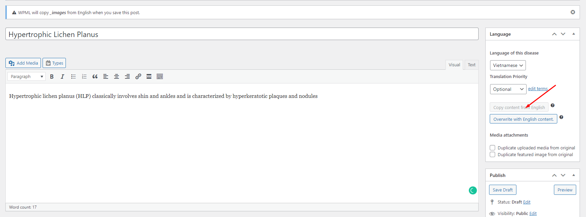
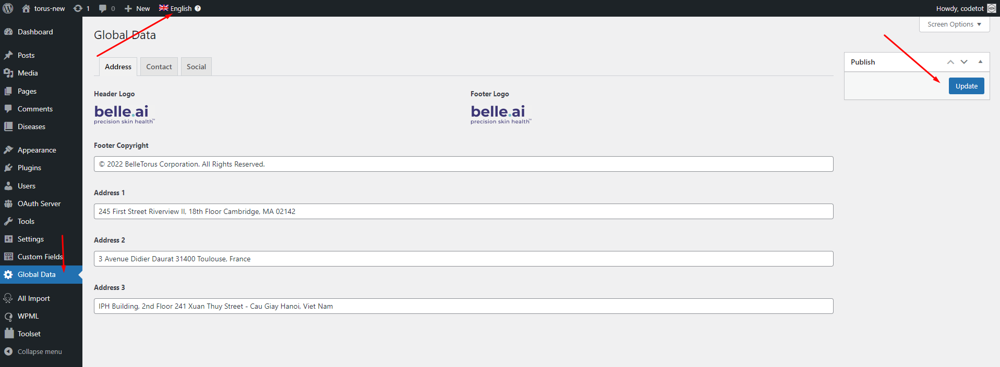

# Đa ngôn ngữ

Hệ thống sử dụng WPML - plugin tốt nhất về đa ngôn ngữ cho WordPress CMS.

**Mục lục**

- [Dịch Disease Category](#dịch-disease-category)
- [Dịch Disease](#dịch-disease)
- [Dịch Global Data](#dịch-global-data)

## Dịch Disease Category

Truy cập vào menu **WPML > Taxonomy translation**, chọn **Disease Category** từ danh sách.

Chọn các item muốn dịch, sẽ có 1 popup hiện ra, nhập thông tin bổ sung và lưu lại.

## Dịch Disease

Chọn menu Disease từ danh sách menu chính. Từ cột ngôn ngữ, lựa chọn bản dịch muốn thêm (là dấu +), hoặc sửa (là dấu -) để tạo bản dịch.

Trong giao diện sửa, chọn mục Copy content from English để sao chép lần đầu dữ liệu bản gốc sang. Nhập các nội dung khác và lựa chọn Disease Category tương ứng để hoàn tất.

## Dịch Global Data

> Các dữ liệu này yêu cầu quyền sửa settings nên chỉ các user đủ quyền mới truy cập được.

Chọn menu **Global Data**, lựa chọn từ menu trên cùng (các ngôn ngữ) muốn dịch và nhập dữ liệu rồi lưu lại.

