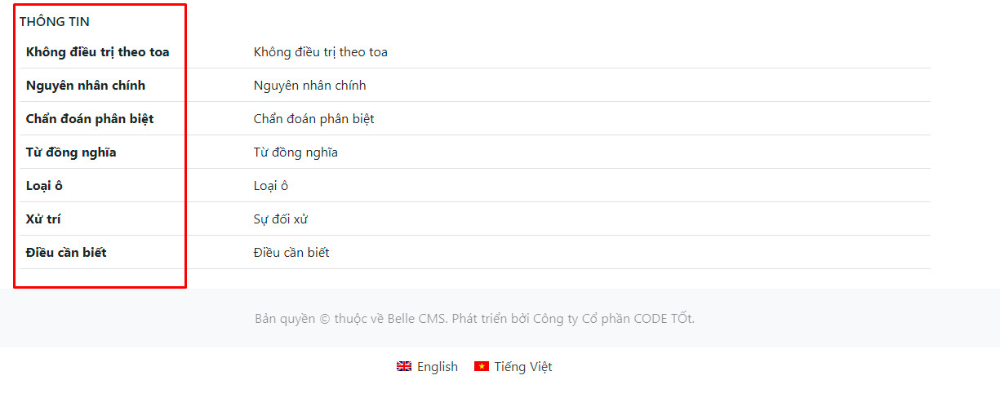
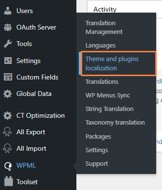
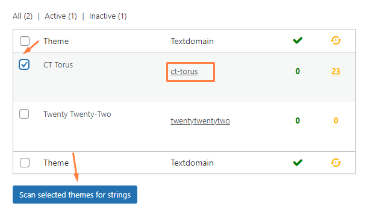
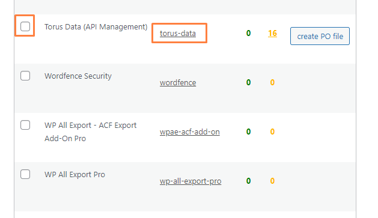
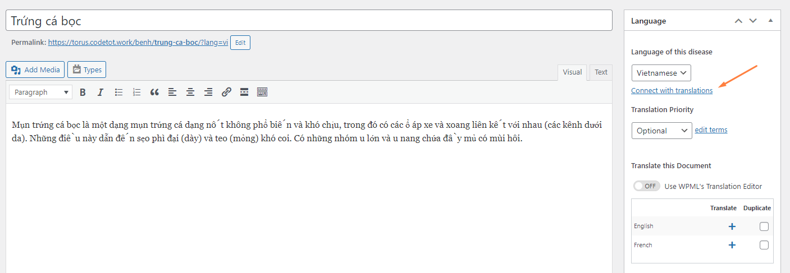
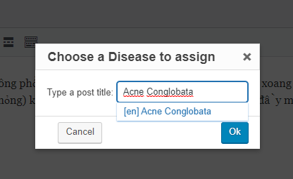
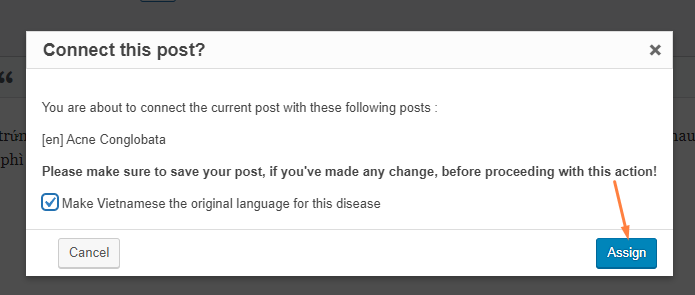
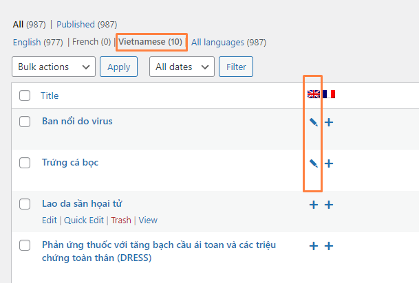
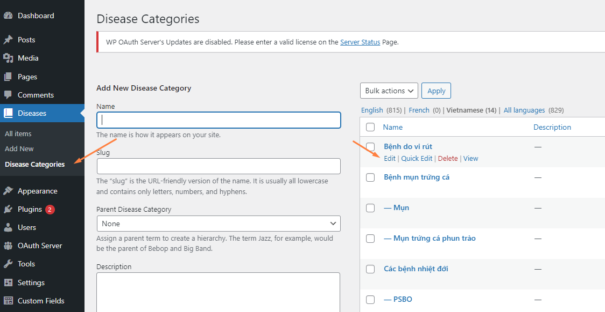

# Đa ngôn ngữ

Hệ thống sử dụng WPML - plugin tốt nhất về đa ngôn ngữ cho WordPress CMS.

**Mục lục**

- [Dịch Disease Category](#dịch-disease-category)
- [Dịch Disease](#dịch-disease)
- [Dịch Global Data](#dịch-global-data)
- [Dịch theme và plugin](#dịch-theme-và-plugin)
- [Đồng bộ ngôn ngữ cho post (Disease, Post, Page)](#dong-bo-post)
- [Đồng bộ ngôn ngữ cho term/category](#dong-bo-category)

## Dịch Disease Category

Truy cập vào menu **WPML > Taxonomy translation**, chọn **Disease Category** từ danh sách.

Chọn các item muốn dịch, sẽ có 1 popup hiện ra, nhập thông tin bổ sung và lưu lại.

## Dịch Disease

Chọn menu Disease từ danh sách menu chính. Từ cột ngôn ngữ, lựa chọn bản dịch muốn thêm (là dấu +), hoặc sửa (là dấu -) để tạo bản dịch.

Trong giao diện sửa, chọn mục Copy content from English để sao chép lần đầu dữ liệu bản gốc sang. Nhập các nội dung khác và lựa chọn Disease Category tương ứng để hoàn tất.

## Dịch Global Data

> Các dữ liệu này yêu cầu quyền sửa settings nên chỉ các user đủ quyền mới truy cập được.

Chọn menu **Global Data**, lựa chọn từ menu trên cùng (các ngôn ngữ) muốn dịch và nhập dữ liệu rồi lưu lại.

## Dịch theme và plugin

Bên ngoài giao diện, một số nội dung có thể dịch thuộc về theme CT-Torus hoặc plugin Torus Data.

Để vào dịch, chọn menu **WPML > Theme and plugins localization**

Có 2 bước cần phải tiến hành:

1. Chọn theme `ct-torus` và đánh dấu "Scan selected themes for strings". Điều này giúp bản dịch cập nhật mới nhất các ký tự từ theme.
2. Để bắt đầu vào danh sách các ký tự cần dịch, click vào thằng cột "Textdomain" tương ứng.

Với plugin Torus Data, cách làm cũng tương tự:

## Đồng bộ ngôn ngữ cho post (Disease, Post, Page)

Một vấn đề cần xử lý là sau khi nhập dữ liệu hàng loạt lên (vd bản dịch tiếng Việt của bản gốc tiếng Anh), ta cần xác định bản dịch của từng nội dung là đối chiếu từ bản gốc nào. Thao tác này hiện tại chưa có phương hướng xử lý kỹ thuật, nên cần thực hiện thủ công theo hướng dẫn.

**Bước 1: Chọn sửa nội dung của bản dịch (không phải tiếng Anh), ví dụ một loại bệnh**

**Bước 2: Tìm mục "Connect with translations" từ cột bên phải**

**Bước 3: Ở popup hiện ra, nhập tiêu đề bản gốc tiếng Anh, sau đó ấn các nút Popup cho tới khi kết thúc**

**Bước 4: Kiểm tra đã đấu nối bản dịch chưa**

## Đồng bộ term/category đã dịch

